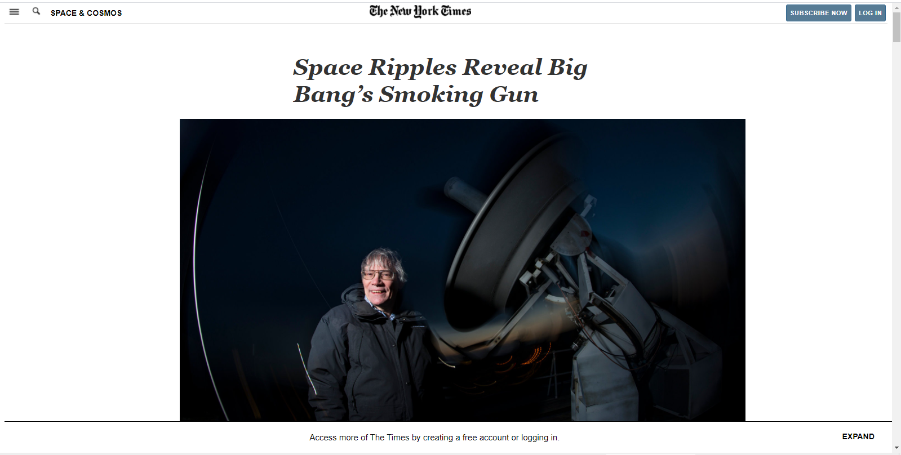
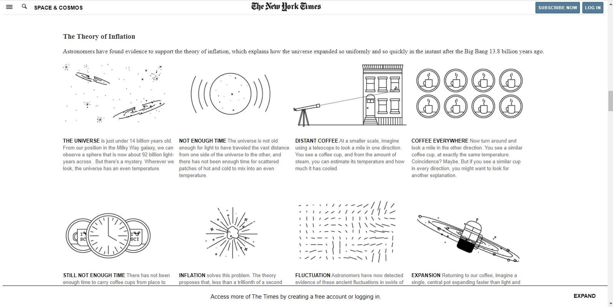
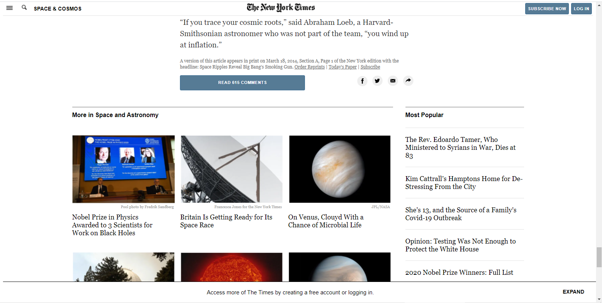

# Form Clone Page - Microverse Project

> This is my third project for Microverse, a clone of New York Times webpage.

## Built With

- HTML & CSS
- Visual Studio, Git & GitHub

## Live Demo

[Live Demo Link](https://anapdh.github.io/TheNewYorkTimes-clonepage/)

## Getting Started

Just download the code in your local machine and go to the dowloaded folder, search for the index.html file and open it in your favourite browser.

### Prerequisites
To run this project, you need a computer or a mobile device with any operating system and a web browser.
### Setup
Just download the code.
### Install
Go to he downloaded folder and search for index.html file and open it in your favorite web browser.
### Usage
This projects diplays the video.

## Author

👩🏼‍💻 **Ana Paula Hübner**

- GitHub: [@anapdh](https://github.com/anapdh)
- Twitter: [@anapdh](https://twitter.com/anapdh)
- LinkedIn: [LinkedIn](https://www.linkedin.com/in/ana-paula-hübner-7a9484181)

## 🤝 Contributing

Contributions, issues, and feature requests are welcome!

Feel free to check the [issues page](https://github.com/anapdh/TheNewYorkTimes-clonepage/issues).

## Show your support

Give a ⭐️ if you like this project!

## Acknowledgments

- To carry out this project we used Microverse Study material, W3 Schools and Google.

## 📝 License

This project is [MIT](license.md/) licensed.